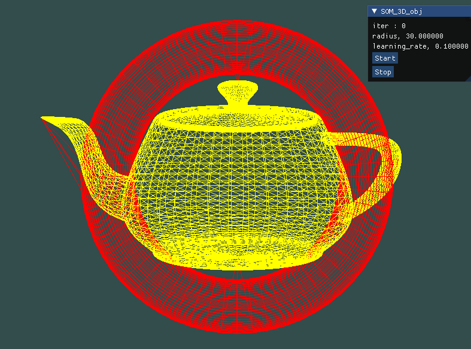
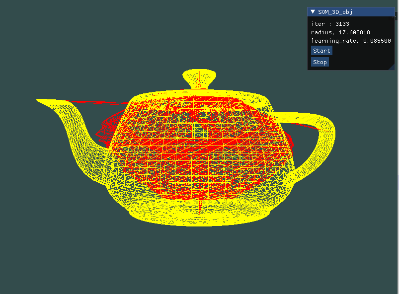
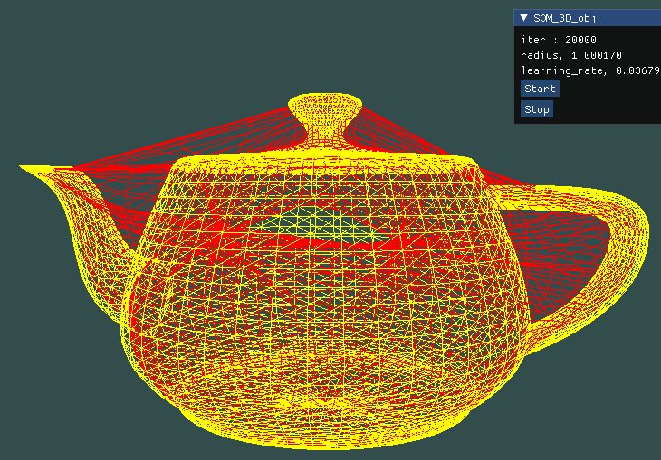
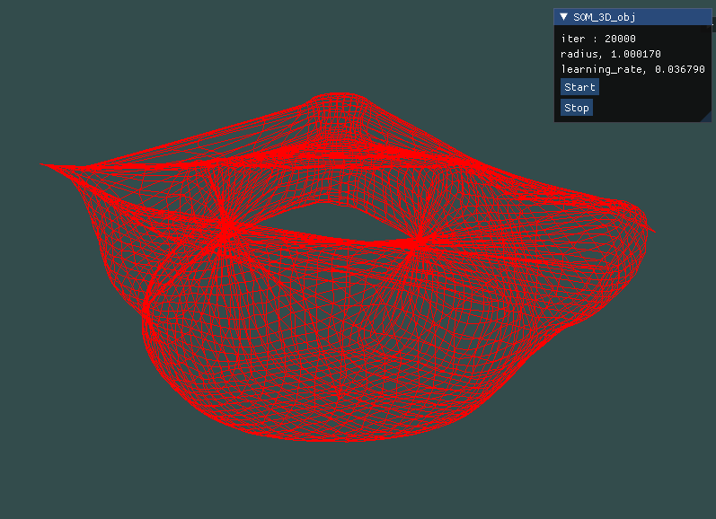
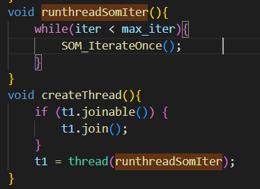

# Self-Organizing Map 3D Demo (OBJ)(donut)(thread)

###### 第一次寫obj檔~~ ######

### 初始化
* lattice是10 * 10隨機生成的網格
* inputdata是用blender做出後再轉乘obj檔
    * obj裡面是``` f 1//1 2//1 3//1 ```，用``` GL_TRIANGLES ```
    * obj裡面是``` f 1/1/1 10/2/1 11/3/1 2/4/1 ```，用``` GL_LINES ```
* 總迭代次數為20000
* 畫面
    * 左邊顯示目前的迭代次數、收縮半徑、學習比率
    * 有按鈕開始即暫停
* 圖形
	* 把所有的obj檔都放在obj資料夾裡
	
* 畫donut
```
    float R = ((m_MaxPos.x - m_MinPos.x) + (m_MaxPos.y - m_MinPos.y)) / 4;
    float r = R / 5.0;
    double rad = 360.0/(double)(map_width-1);
    for (int i = 0; i < map_width; i++)
    {
        for (int j = 0; j < map_height; j++)
        {
            double fi = (double)i*rad *PI/180.0;
            double theta = (double)j*rad *PI/180.0;

            double i0 =  cos(fi)* ( R + r*sin(theta));
            double j0 = sin(fi)* ( R + r*sin(theta));
            double k0 = r * cos(theta)-0.2;6

            lattice[i][j] = {i0, j0, k0};
        }
    }
```

* anchor point

把dataset和lattice最上下左右的點連在一起不能動
>未來預計能使茶壺的手把貼合更好

* 操作

| 按鈕  |	 效果	   |
| ---- |:-------------:|
| G    | 開始        |
| t    | 暫停        |
| B    | 隱藏dataset  |
| F    | 鏡頭拉遠     |
| R    | 鏡頭拉近     |
| A    | 鏡頭向左     |
| D    | 鏡頭向右     |
| W    | 鏡頭向上     |
| S    | 鏡頭向下     |
| J    | 鏡頭向右旋轉  |
| L    | 鏡頭向左旋轉  |
| K    | 鏡頭向下旋轉  |
| I    | 鏡頭向上旋轉  |

 

### 開始執行

 

### 結果
 
 

### 進階
運用thread
讓SOM的迭代不受螢幕幀率的影響
 